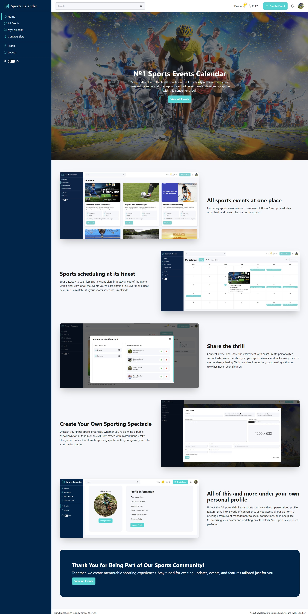
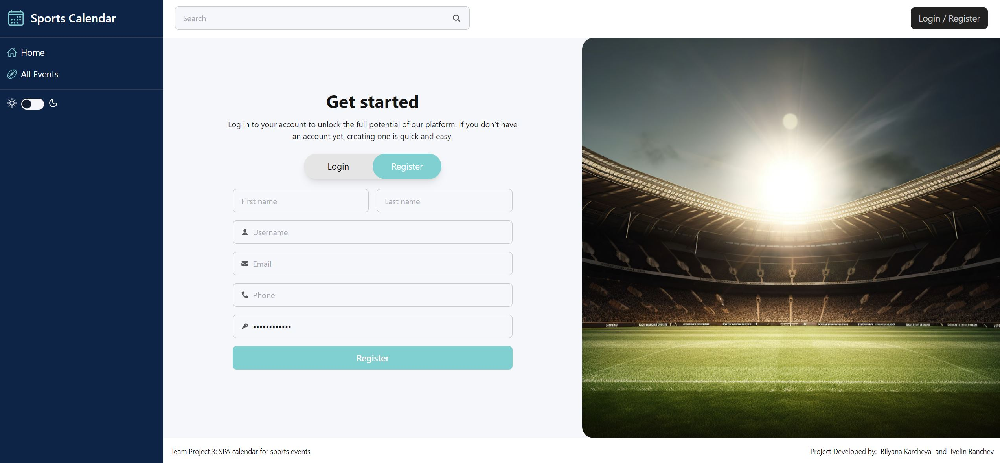
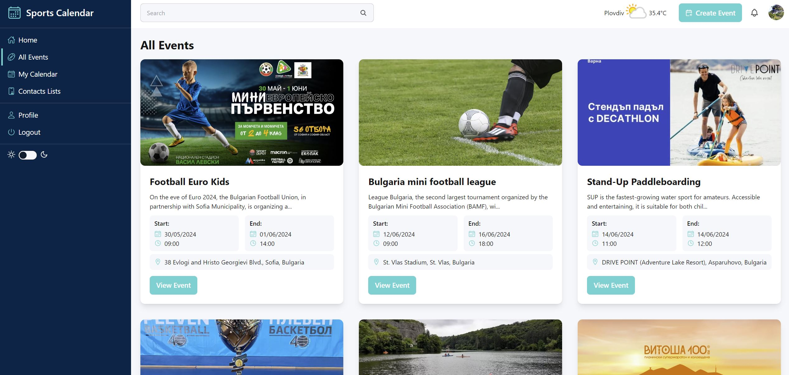
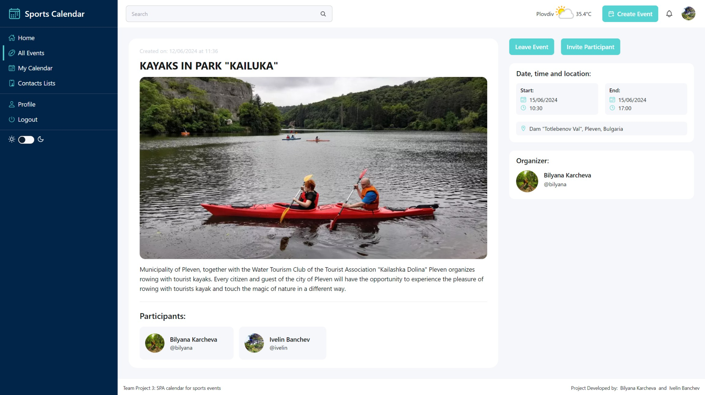
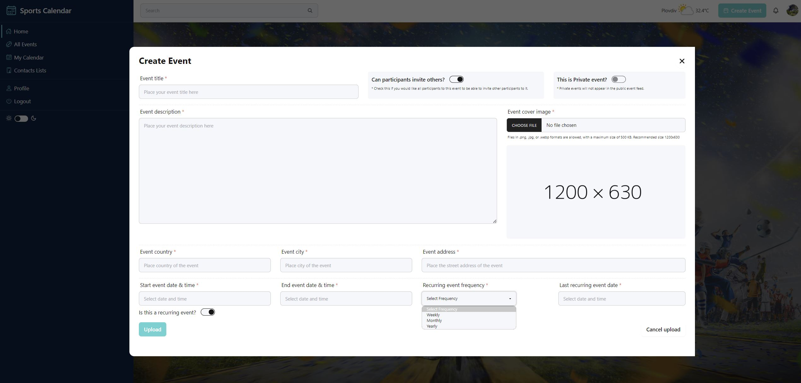
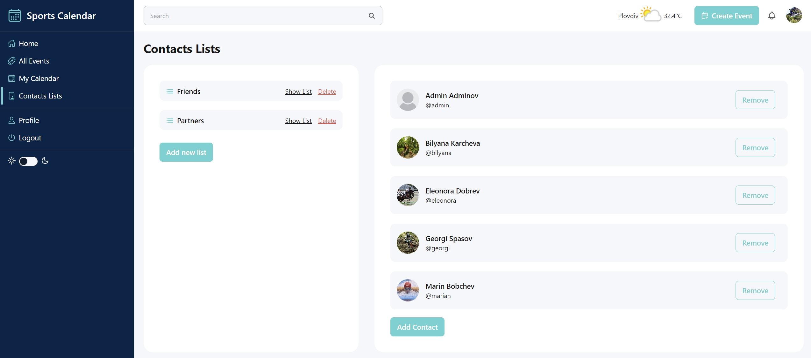
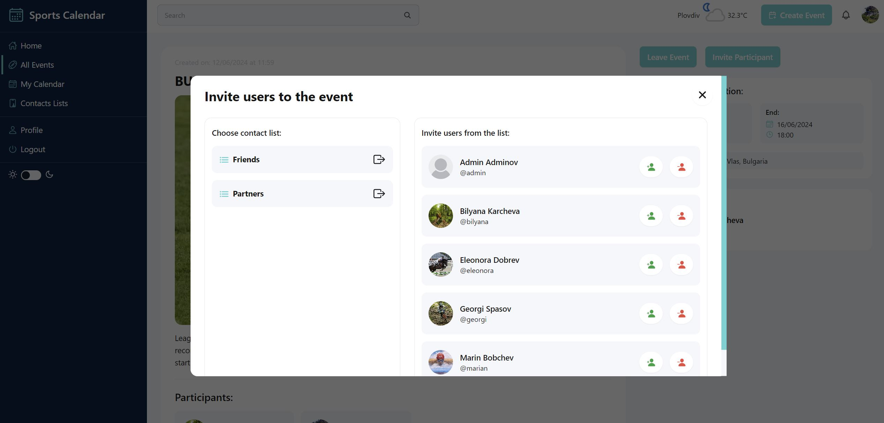
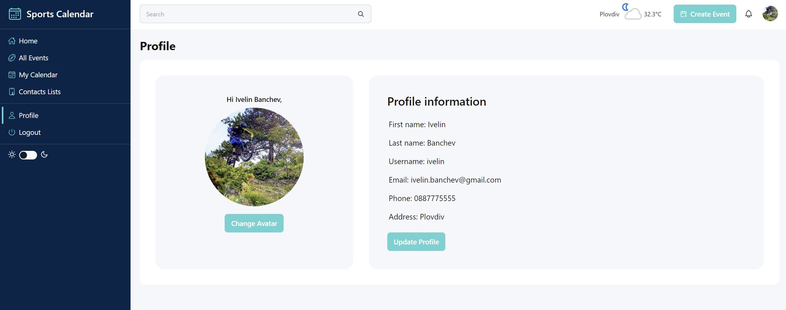
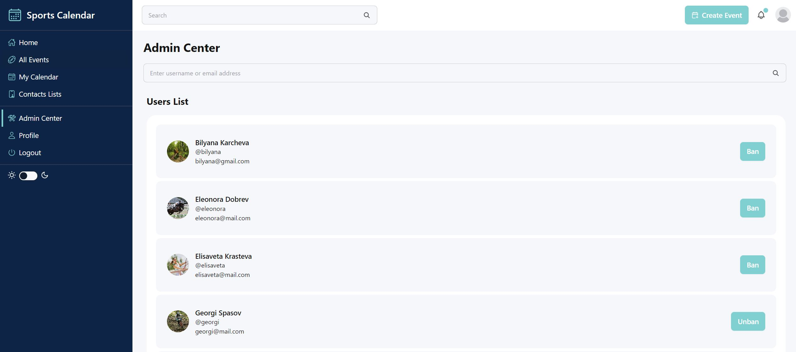
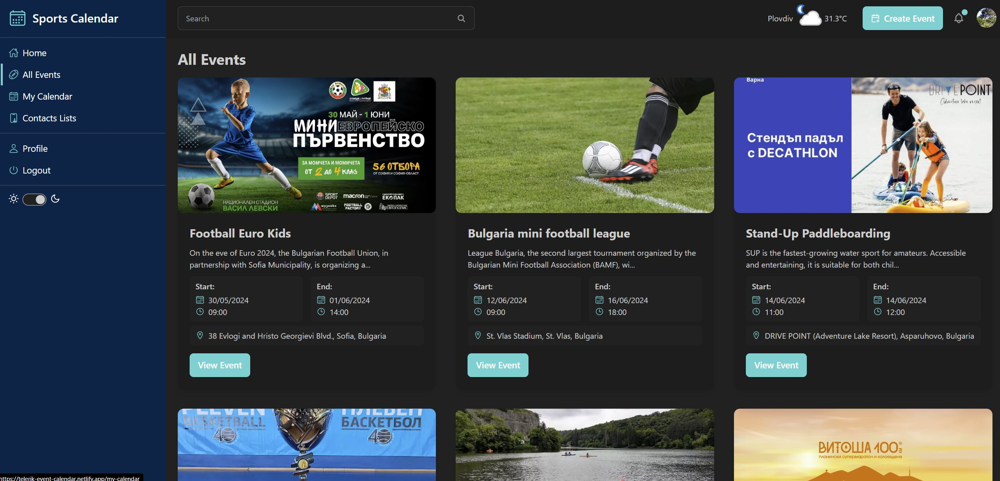

# Web Project 3: Sports Calendar

## Description

Introducing Sports Calendar: a user-friendly app designed to unite sports enthusiasts in one convenient platform. Here, users can browse all upcoming sports events and add the ones they are interested in to their personal calendar, ensuring they never miss a moment. Users can also create contact lists and invite friends to the events they're participating in, sharing the thrill together. And for those who want to take the lead, users can create their own events—either public for anyone to join or private for just the friends they invite.

DEMO: https://telerik-event-calendar.netlify.app/  

## Installation

1. Clone the repository to your local machine.
2. Run `npm install` to install all dependencies.
3. Create .env file and add the following information: 
   `VITE_WEATHER_API_KEY={OpenWeather API Key}` 
   `VITE_FIREBASE_API_KEY={Firebase API Key}` 
   `VITE_FIREBASE_DATABASE_URL={Firebase DB URL}` 
   \*Choose Realtime Database and Email/Password auth method.
4. Finally run `npm run dev` to start vite server.

## Creators

Bilyana Karcheva - [@bilyanakarcheva](https://github.com/bilyanakarcheva) 
Ivelin Banchev - [@banch3v](https://github.com/banch3v/) 

## Technologies used

JavaScript 
React 
Firebase 
Tailwind 
DaisyUI 
OpenWeather API 
ESLint 
git 

## Packages used

date-fns 
react-datetime 
react-toastify 
react-icons 
<i>\*no out-of-the-box package used for the calendar functionality</i>

## Project features

### Public and Private part

Utilizing Firebase authentication, the app is divided into private and public parts. Non-registered users can access only the public part: Homepage, All Events, and Login/Register. The private part, which includes the rest of the app's features, is accessible only after logging in.

### Homepage

A landing page designed to showcase the platform's features and make it more attractive. Accompanied by call-to-action prompts, it effectively guides users towards conversion.

### Login or Register

All visitors can log in to an existing profile or create a new one on the platform. All inputs are validated to ensure data correctness.

### All Events

All visitors can view all public events on the All Events page, but only logged-in users can access their detailed pages. Additionally, the platform offers the option for private events, which are visible exclusively to users participating in them.

### Event Details

Each event has its own detailed page, offering additional information. Users have the option to join or leave events, and if they're participating, they can invite friends. Event creators retain the ability to edit the event content or delete it as needed.

### Create Event

Users have the flexibility to create as many events as they desire. They can choose whether the event should be public, granting access to everyone, or private, restricting access to only invited users. Additionally, users can opt to disable the ability for participants to invite others to the event. If users wish to create multiple date events, they have the recurring event option where they can specify event's recurrence frequency on weekly, monthly, or yearly basis.

### Contacts Lists

The Contacts Lists feature enables users to create personalized lists and add as many contacts as they desire. These lists facilitate socialization and streamline the process of inviting users to the events in which they are participating.

### Event Invitation

Each user participating in an event can invite another user from their contacts list to join the event, provided the event creator has enabled this feature.

### Notifications

The platform incorporates a real-time updating feature that notifies users when they've been invited to an event by other users. Users have the option to accept, decline, or view more information about the event before making a decision.

### Profile

On the profile page, users can view or edit their personal information and upload/change their avatar. If users provide their city name, an Easter egg feature is activated in the header, displaying the current temperature in the user's location.

### Admin

Admins possess superuser rights, enabling them to ban other users and edit or delete events created by other users. Banned users are subsequently unable to log in to the platform.

### Dark Mode

For enhanced user experience, we've implemented a dark-light mode functionality, giving users the option to choose a website view that best suits their preferences

